# Button Names and Explanations

Buttons click on and off and turn blue when activated. Hovering over a button makes a box appear that describes its function. The buttons are described below in alphabetical order. Use this list to find the button name then scroll down for an explanation of the button’s function:

## 1. Names.
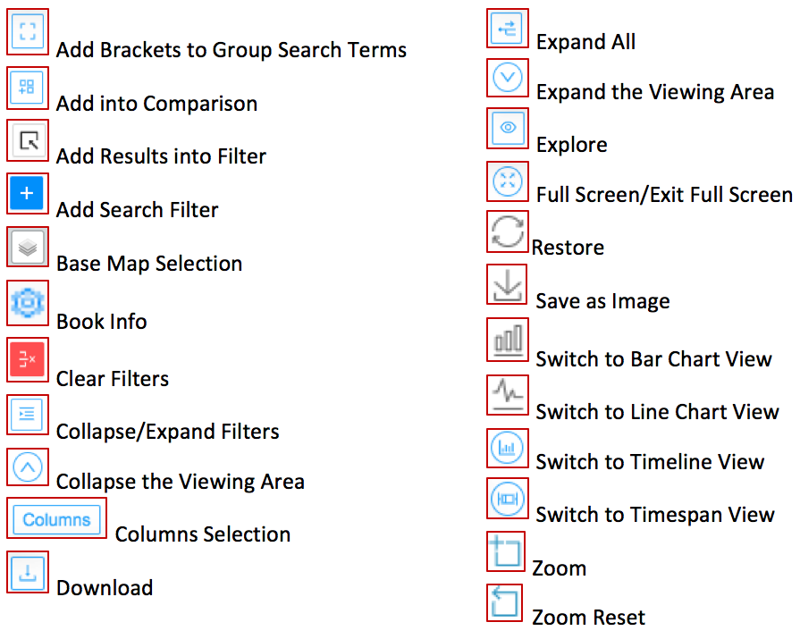

## 2. Explanations

#### Add Brackets to Group Search Terms

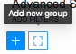

In Advanced Search, search terms can be grouped by clicking the “brackets” button. Brackets can be moved within the search panel by using the up or down arrows. 

#### Add into Comparison

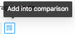

This button is used to add either an individual result or a group of results as a series into the comparison tool. A popup appears when a cursor hovers over the button, as in the image below:

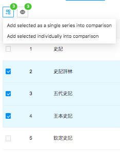

#### Add Results into Filter

This button adds results back into the “Refine Results” search panel. This allows the user to add terms and search within the original results.

#### Add Search Filter

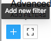

In Advanced Search, add a new filter to search criteria by clicking the solid blue “plus” button.

#### Base Map Selection

In the Geo-distribution panel, click this button to change the base map and add place names and boundary information from the China Historical Geographic Information System.

#### Clear Filters

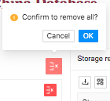

In Advanced Search, the larger red button is used to remove all filters, and the smaller red button is to remove a specific filter. In the Collect and Compare page, the round red button clears all and the square red button clears a single item. See below:

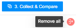
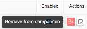

#### Collapse Filters

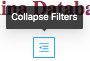

In Advanced Search, the “Collapse Filters” button will close the filters panel.

#### Collapse the Viewing Area

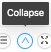

Use this button to return to the original viewing-window size.

#### Columns Selection

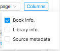

In data table view, use the “Columns” button to choose which information to display.

#### Download

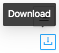

Use this button to download search results.

#### Expand All

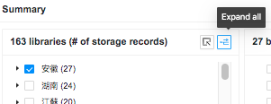
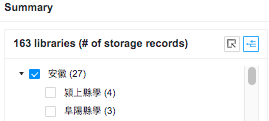

In the summary view of libraries, clicking the “Expand All” button displays location names and number of records for both the province and the specific locations. 

#### Expand the Viewing Area

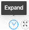

Use this button to partially expand the data table, timeline, or map viewing area without going to full screen.

#### Explore

The Explore button appears in two places on the results page: On the right side, the button appears with each result and clicking it will only bring up that single result in the “Explore” page. On the upper left of the results page, the Explore button can be used to explore multiple results. Hovering over it brings up the message, “Explore Selected.”

#### Full Screen/Exit Full Screen

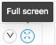
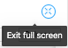

Click the “four arrows” button to fully expand or contract the viewing area. When the viewing area is fully expanded, the “Home,” “About,” and “Sources” buttons will not be visible.

#### Restore

This button returns the view back to the original view.

#### Save as Image

In the Timeline panel and the Collect and Compare page, a visualization can be saved as a .png file. Before saving, in the Timeline a legend may be added and color selected using the “Legend” and “Color” boxes. In Collect and Compare, the label for each book or data series can be changed by clicking in the box under “Label.” The pie chart for a particular year is activated by clicking on the line chart or bar graph. The position is indicated by a dotted line. 

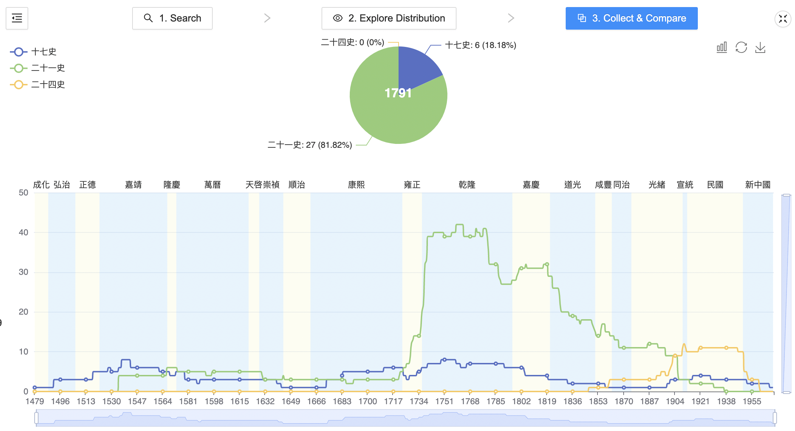

#### Switch to Bar Chart View

In the Collect and Compare Timeline, the default setting is line chart. Click on this button to switch to a bar chart view.

#### Switch to Line Chart View

In the Timeline panel, the default view is a bar graph. Clicking this button switches the display to a line chart. To switch back, click on the “Restore” button:

#### Switch to Timeline View

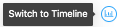

This button toggles between the timeline and timespan views and changes its icon when the view is switched. 

#### Switch to Timespan View

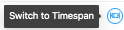

This button toggles between the timeline and timespan views and changes its icon when the view is switched. 

#### Zoom

In the Timeline panel, the user can zoom to specified years by clicking the button and then clicking and dragging over the desired years. This can also be done with the scroll bars at the bottom of the timeline (see below). 

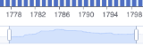

Clicking on a particular year in the timeline brings up the data table for that year.

#### Zoom Reset

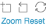

After Zooming multiple times in the Timeline panel, the user can use this button to go back one zoom. It is like an “undo” button in Word. To go back to the original view, click the Restore button.
