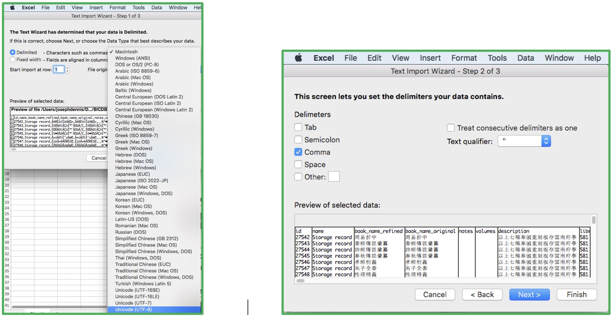

# Frequently Asked Questions

Q: When I download search results data, the Chinese characters are garbled in the CSV file; how do I fix that?

A: There are various ways: Chinese should appear correctly when imported into Google Sheets. Importing the data into Excel may require specifying Unicode (UTF-8) under the “File Origin” dropdown menu in the “Text Import Wizard” and then switching the delimiter to “Commas.” See the figures below:

Q: Can I download all of the data? 

A: BIC is not currently set up to allow downloading of the entire data set.

Q: Can all of the books in the database be displayed on the map at the same time? 

A: Not at present. There is too much data for the current system to display it without undermining performance.

Q: Are the books categorized?

A: Some books currently have category information in the “Description” or "Notes" fields, but most do not. The categories of those that do were taken from book lists that separated books by category or were taken from WCAT when researching the dating. Additional category information from external sources will be added in the future. 

Q: What should I do if I find a mistake?

A: Please fill out an error reporting form. Data will be updated periodically.
