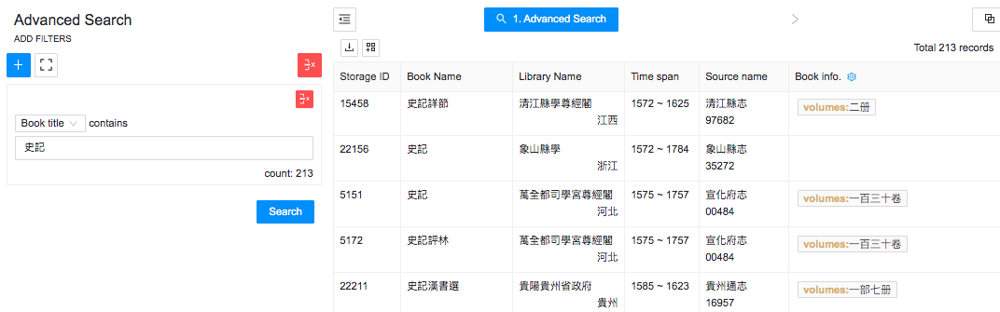
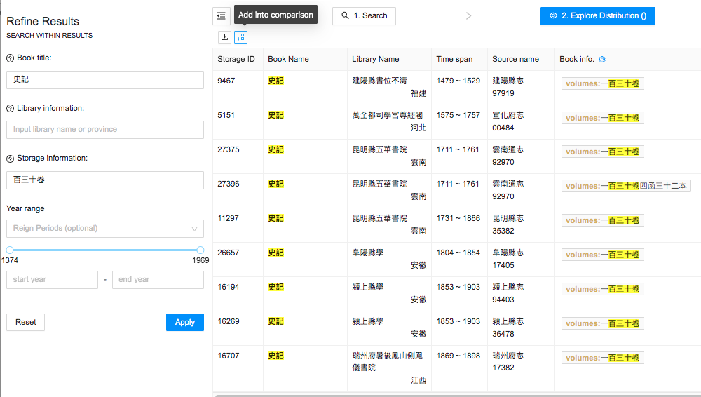
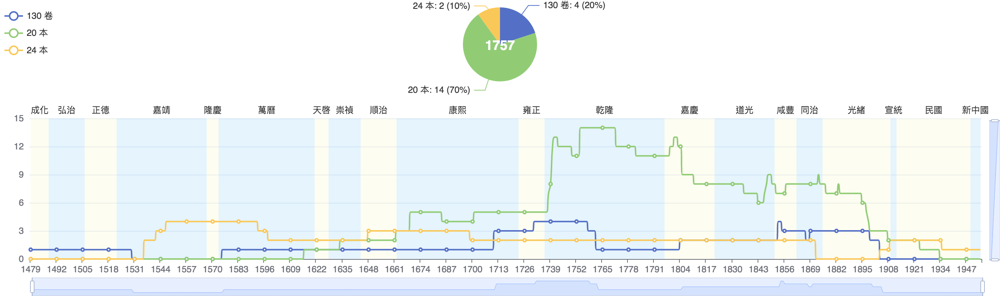
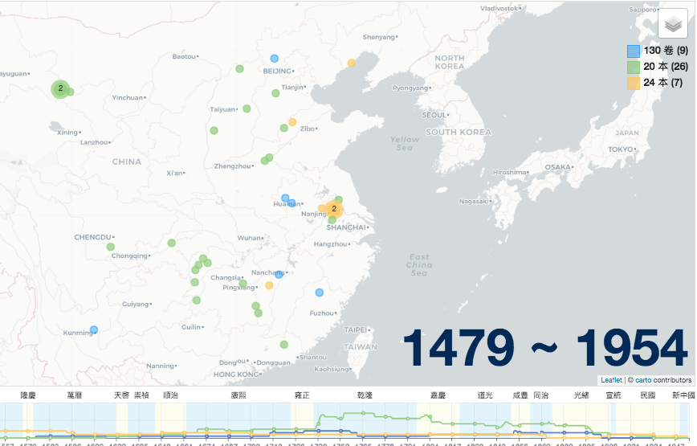
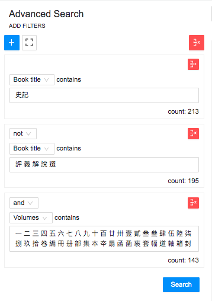

# Advanced Search Example

Advanced search allows searches in fields other than book title. Suppose you wanted to research different editions of the *Shiji* 史記 (The Grand Scribe’s Records). You could start by adding a book title filter in Advanced Search and then typing 史記. Then use the Book Info button to restrict the display to “volumes,” as in the image below, to identify various configurations in which it was published.

Although most school library book list entries do not contain explicit edition information, they often record the physical configuration, which is a clue to the edition. For example, the *Shiji* results in the data table contain versions in two, seven, eight, ten, thirteen, sixteen, twenty, twenty-two, twenty-three, twenty-four, twenty-five, twenty-six, twenty-eight, thirty, thirty-six, and forty volumes (ben 本 or 册), and 130 chapters (juan 卷). Some records also list the number of boxes, e.g., one lists the *Shiji* as being 130 chapters in four boxes containing thirty-two volumes (*yibaisanshi juan si han sanshier* ben 一百三十卷四函三十二本). 

To look for patterns, the various configurations can be added into the comparison tool
by searching for desired configurations separately, then clicking the “Add into Comparison” button.

Repeat this process to add other configurations, then click on the “Collect and Compare” button. To make the comparison easier to read, add labels. If you want to save an image of the timeline, pick a year for the pie chart and click “Save as Image.”

You can also look for regional variations using the map tool in the comparison view. In the figure below, the map shows that the twenty-volume version is both most numerous and geographically dispersed.

The Advanced Search described above started with “史記” in the title, which will pull in various books related to the *Shiji*. If you wanted to find *Shiji* records with volume information, but exclude *Shiji* commentaries, abridgements, etc. from the results, you can add limiting terms, such as 評, 義, 解, 說, 選, etc. and link the title terms with “NOT,” then add numbers and volume terms in the Volumes filter, such as this set: 一 二 三 四 五 六 七 八 九 十 百 廿 卅 壹 貳 叁 叄 肆 伍 陸 柒 捌 玖 拾 卷 編 冊 册 部 集 本 夲 扇 函 圅 袠 套 幅 道 軸 箱 封. In this search, numbers should be entered in both simple and complex forms because they appear in records both ways.

