# Basic Book Title Search Example

To find records for a specific book title, enter one or more versions of the title in the “Basic Book Title Search” box on the homepage. For example, if you were interested in *Jiaonü yigui* 教女遺規 (bequeathed rules for the teaching of girls) by Chen Hongmou 陳宏謀, simply type the title into the search box. The results page shows that there are twenty-eight storage records that contain this title and that they range in time from 1726 to 1927:
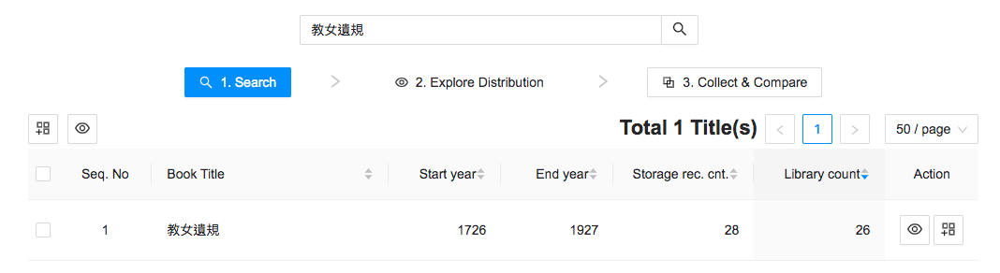

From here, the user can explore the results by checking either the box to the left of the book title, or the “select all” box directly above it. Then click on the Explore button (the eye symbol), which will load the results:
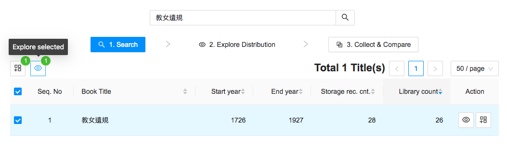

The page that comes up will have five sections: The data table (storage records), summary, timeline, geo-distribution, and refine results panel. If your screen is not large enough to display all fields, scroll down to see the timeline and geo-distribution tool.
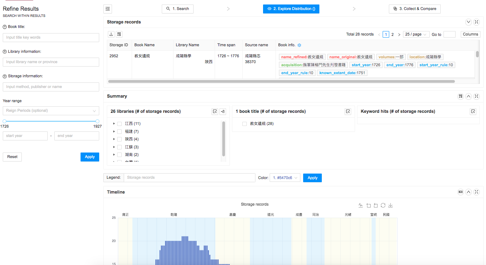

Next, expand the data table to examine detailed storage records. 
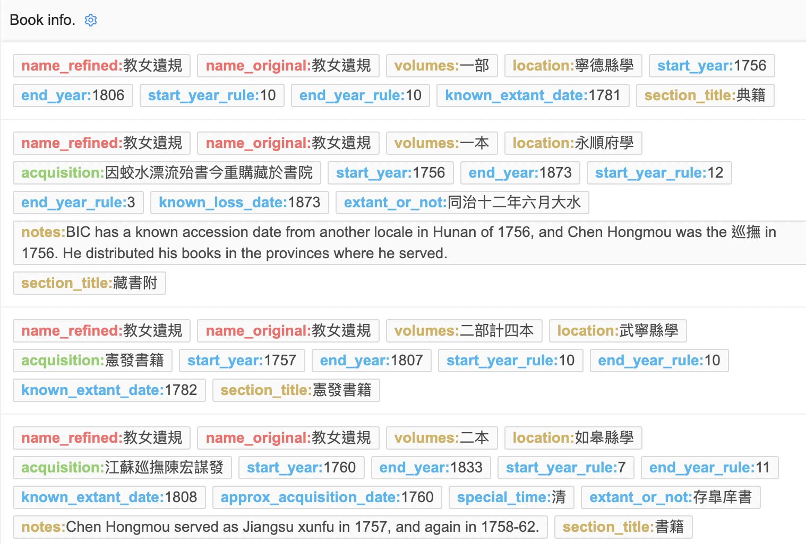

In the data table view, users can select desired categories of information by clicking on the Book Info button at the top of the panel. For example, if you only want results with a known accession date, you can select that feature:

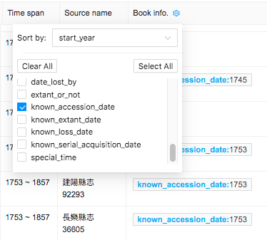

The fields listed below can be selected for display in the data table. See the Data Paper for field descriptions.
book_name_refined
book_name_original
section_title
author_compiler
acquisition
description
notes
volumes
library_id
book_location
gazetteer_publish_date
start_year
start_year_rule
end_year
end_year_rule
approx_acquisition_date
approx_loss_date
acqud_by_date
acq_after_date
date_lost_by
extant_or_not
known_accession_date
known_extant_date
known_loss_date
known serial acquisition date
special_time

Click on the Columns button to add library information and source metadata.
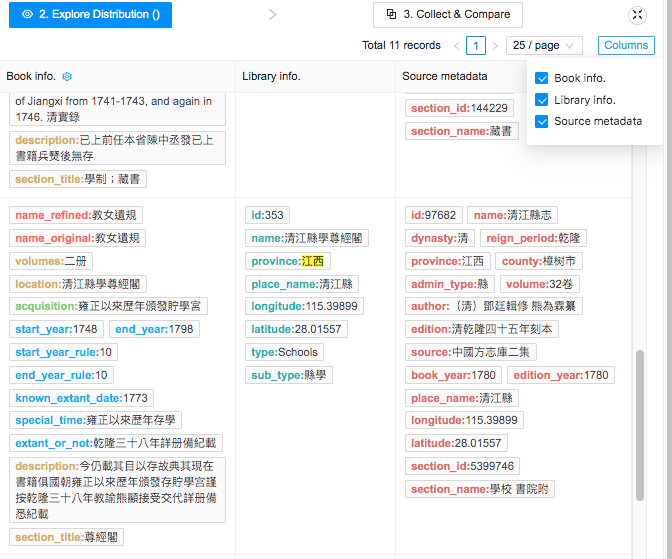

From the data table it is clear that Chen Hongmou distributed *Jiaonü yigui* to Confucian schools in the provinces where he was serving as provincial governor. If you wanted to examine the history of *Jiaonü yigui* in one province, you could click on a province name in the Summary panel. For example, if you click “江西” and then the “Add Results into Filter” button, BIC will display only the eleven results from Jiangxi. Within the results displayed in the data field the user can search for particular terms results by doing a “find” (Command F on a Mac). This will bring up a search box. Results will be highlighted in yellow.
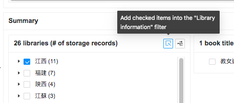

These results could be refined to those containing Chen Hongmou’s surname by adding “陳” into the “Storage Information” search box in the Refine Results panel.
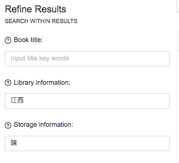

The locations of the four storage records will appear on the map in the Geo-distribution panel. In the map, provincial and prefectural boundaries have been added using the Base Map Selection button. There are only three dots for four records because one location (Jishui County School 吉水縣學) has two records of the same book.
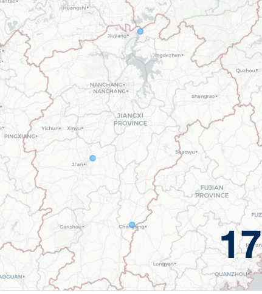

Clicking on the blue dot will bring up the storage record as a side panel.
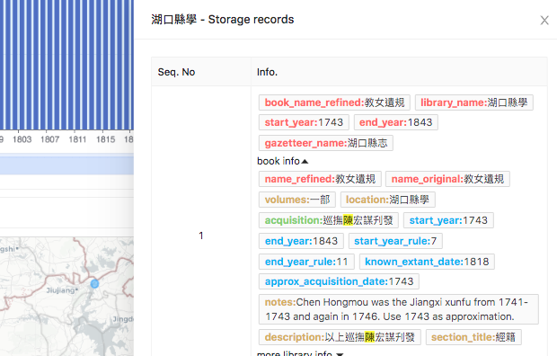

A timeline of all *Jiaonü yigui* records can be saved as an image file with a legend added and color selected.
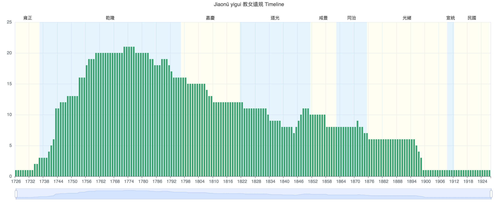

If you wanted to research *Jiaonü yigui* not only as a stand-alone title, but as one of five works later published as a set (*Wu zhong yi gui* 五種遺規), you could enter all of the titles in the initial search, as in the screen shot below:
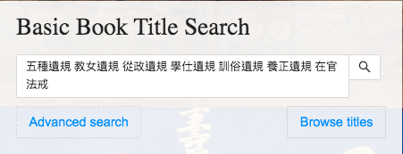

This would produce a larger set of storage records:
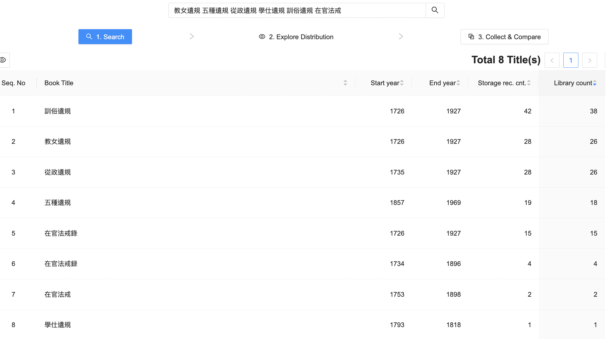
