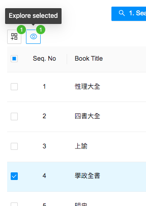
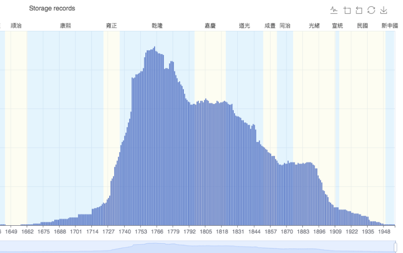
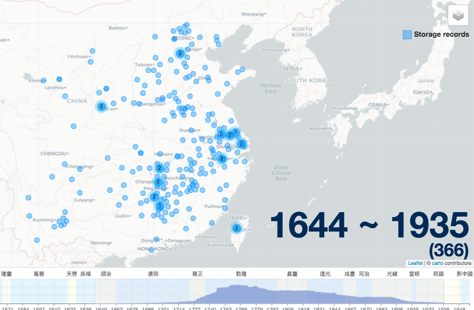

# Browse Titles Example

Clicking the “Browse titles” button on the homepage will bring up a list of all book titles in BIC, their start and end years, and number of records and libraries in which they appear. In addition, there is a panel with filters to refine your search. This is useful if you do not wish to start your research with a specific title, but instead want an overview of the relative commonality of specific titles. For example, on the Browse Title page the Xuezheng quan shu 學正全書 (complete book of school administration) is listed as one of the most common titles in BIC.  To explore it further, check the box next to the title and click the “Explore” button. 

After putting this title into Explore, the timeline and map will show that the book was most common between the mid-eighteenth century and late-nineteenth century, and that its distribution was widespread.

